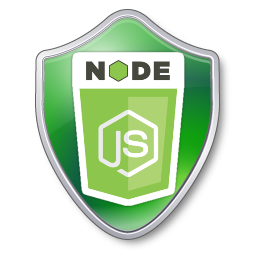

Ncapsulate
==========

NuGet and MSBuild wrappers around various Node based tools.


Why Ncapsulate?
---------------
Ncapsulate's goal is to surround useful tools like NodeJS, NPM, Bower, Gulp
and more while not requiring developers to install the tools or understand
how to use their console, and console commands.

The goal is to make it portable and compatible with NuGet Package Restore.
With those goals in mind, it allows larger .NET development teams to adopt
different Front End Tools for building applicaitons, without affecting the
developer that typcially works behind the scenes, and doesn't care about
the front end world.  While giving the Front End Developers the ability to
adopt modern tools, and processes to create exceptional User Experiences.


How does it work?
-----------------
Ncapsulate plays off the fact that Node can run as a single executable, and
then uses Nuget dependencies so that you only need to install tools you plan
on using.

In addition since the user is downloading Node as a Nuget package, Ncapsulate
also provides extra (optional) MSBuild tasks, so that integrating any of the
tools is extremely easy, and allows you to follow other build patterns, such
as incremental builds, so tasks only run if they are needed.  This allows
JavaScript projects to only impose a 1 build slow down on Back-end developers
that may not do any work in the JavaScript space.


# Installing

### Visual Studio
Search for `Ncapsulate.Node` in the Nuget Package Manager 

### Package Manager Console
`Install-Package Ncapsulate.Node`

### Configuration
Once installed you will have 3 new items in your solution.

#### CMD files
`node.cmd` and `npm.cmd` are shortcuts to run those commands from the command line without
having to install node locally for a developer.  These can be "excluded" from
the project if you do not want the clutter, but they __must be committed to source
control__, so that they exist for the tooling to work correctly.

#### Targets
You will also have a new folder `App_Build`, this folder will contain `.targets` files
for each dependnency you have installed.  These can be removed safely if you do not need them.

Targets are very useful though, these allow you to change the your projects build without needing
to manually edit the project xml, which forces you to unload the project.  In these targets files
we have some examples of using Inputs/Outputs to create incremental builds that only change
as dependent files change.


# Ncapsulate.Node


This is the primary package, and it includes both Node and Npm since they are
generally both required for anything else to work.

## Features
- Node
- NPM

## Tasks
### NpmInstall
This task allows you to invoke `npm install` without using the command line.
In addition this task also allows you to specify a specific dependency if
for example you do not want to use package.json for keeping node packages.

#### Usage
```
    <NpmInstall [Module=""] />
```


### NpmUpdate
This task allows you to invoke `npm update` without using the command line.
In addition this task also allows you to specify a specific dependency if
for example you do not want to use package.json for keeping node packages.

#### Usage
```
    <NpmUpdate [Module=""] />
```


# Ncapsulate.Bower


This is a package that brings in bower integration to Ncapsulate.

## Tasks 
### BowerInstall
Installs the bower packages much like calling `bower install` from the command line
In addition this task also allows you to specify a specific dependency if you
for example do not want to use a bower.json file for keeping bower dependencies.

#### Usage
```
    <BowerInstall [Module=""] />
```

### BowerUpdate
Installs the bower packages much like calling `bower update` from the command line
In addition this task also allows you to specify a specific dependency if you
for example do not want to use a bower.json file for keeping bower dependencies.

#### Usage
```
    <BowerInstall [Module=""] />
```

# Ncapsulate.Grunt

This is a package that brings in grunt integration to Ncapsulate.

## Tasks 
### Grunt
Allows you to run a specific grunt task as part of your build build process.  Tasks
are optional and will default to `default` just like calling grunt from the command
line.

You can specifiy the grunt file if it differs from the default `gruntfile.js`, as well
as set Force and Verbose for additional needs.

#### Usage
```
    <Grunt [Tasks=""] [Gruntfile=""] [Force="true|false"] [Verbose="true|false"] />
```

# Ncapsulate.Gulp

This is a package that brings in gulp integration to Ncapsulate.

## Tasks 
### Gulp
Allows you to run a specific gulp task as part of your build build process.  Tasks
are optional and will default to `default` just like calling gulp from the command
line.

You can specifiy the gulpfile if it differs from the default `gulpfile.js`, as well
as you can set optional parameters, since by default gulp does not have the concept
of force or verbose.  Though you can define custom ones, for example being able to
have different builds for Release or Debug.

#### Usage
```
    <Gulp [Tasks=""] [Gulpfile=""] [Params=""]/>
```


# Ncapsulate.Karma

This is a package that brings in karma integration to Ncapsulate.

## Tasks 
### Karma
Starts a single run of Karma with the given settings.  This allows you to customize
the karam run based on various items such as browsers or reporters, much like running
against the command line.

#### Usage
```
    <Karma [Configfile=""] [Port=""] [LogLevel=""] [Reporters=""] [Browsers=""] [CaptureTimeout=""] [ReportSlowerThan=""] />
```


# For Developers

## Build Tasks
Build tasks are used to create additional Ncapsulate packages.  The
process is generally very similar per dependency so these are helper tasks that
let you create a dependency with very little fuss.

### GetVersion
Get's the version of the given npm dependency.

#### Usage
```
<GetVersion Name="bower">
  <Output TaskParameter="Version" ItemName="BowerVersion" />
</GetVersion>
```

### InstallModule
Installs the given modules to prepare them for being included in a nuget package.
This will also squish the node_modules directories.  
_NOTE: This can at times cause issues with different versions of dependences, if
there is a breaking change.  So be mindful that your dependency works as expected_

#### Usage
```
<InstallModule Modules="bower" />
```

### NcapsulateTask
This is a base class that can be used to execute commands against node.  This is used
to construct custom tasks like `<BowerInstall Name="" />` to create tasks that can
be consumed by your end users.


# Contributing
Any additional help would be great, I welcome any pull requests to add new dependencies
that you feel might be benefical.  Once we execeed 10 or so npm packages I would like break
each project out into seperate git repo's to increase seperation.


### Logo
Logo was found via Google image search, and is used under the appropriate creative commons license.
http://pencilshade.deviantart.com/art/New-worksafety-gasmask-symbol-87581552
